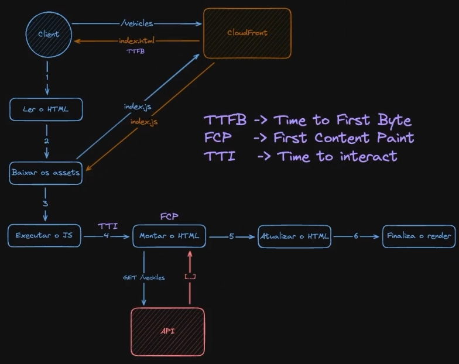
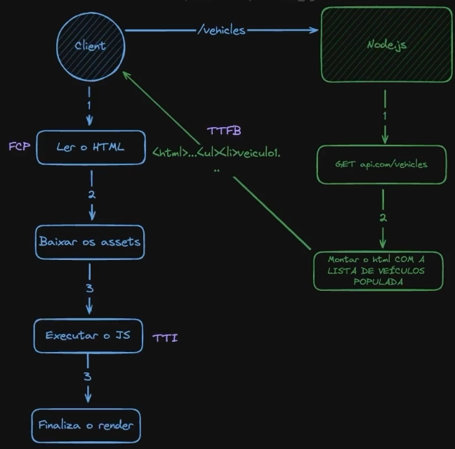

# Entendendo NEXT

- TTFB -> Time to first byte
- FCP -> First content paint
- TTI -> Time to interact

# How a SPAs works:

# How Server Side Rendering works:

# NEXT

By default every component is `Server compoent`

- to create a **client component** you need add a `"use client"` on top of the file.

  - can't use async function
  - log's will be displayed in client and server side. `Because next will render in server and also in client side to make the hydratation on the html sended by the server`.

- A server component can be `father` of a lot of `client` components. (**_Need pass the server data by children or props_**).
  - like you create a **Button** component (client) and use in a server component. (it will woks)

## Routing

Routing based on file system

- The pages need be **_export default_**
- Your pages need has _PAGE_ as name.
- To create a not found page you need add `not-found.tsx` file in your app folder.

/vehicles

-> import Page from `src/app/vehicles/page.tsx`;

/vehicles/list

-> import Page from `src/app/vehicles/list/page.tsx`;

### Root Group

- Creating a folder with (), the url will not be affected by the name of the folter.

example:

/src/app/(dashboard)/makes/page.tsx

the url will be: `/makes` and not `/dashboard/makes`

### Dinamyc routes

- Creating a file with [ ]
  - can recive [...<name>] to recive more than one parameter.

using [] next add a prop params with the name of the file and return the params used in the url.

example:

`/makes/bmw`

return:
{params: {make: 'bmw'}}

### Streaming components

Streaming is a data transfer technique that allows you to break down a route into smaller "chunks" and progressively stream them from the server to the client as they become ready.

Example:
Using loading.tsx in the same root of you file that is a (server side rendering)..
