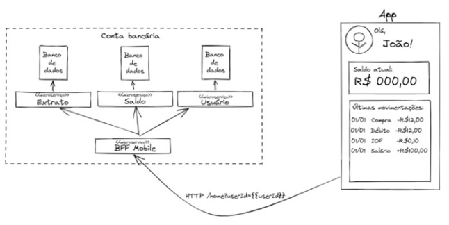

# Api routes e middlewares no next

Next é um framework composto por 5 "blocos":

- React
- Routing
- SSR
- API Routes - Routes Handlers
  - Next é um framework `full stack`
- Data fetching

**_Monolito_** / **_Monolith_** -> tudo no mesma aplicação (back-front)

---

Com next é muito facil contruir backends `BFF`

- Back-end For Front-end

  - Backend serve para atender as regras enecessídades específicas do client.
  - Exemplo: Uma tela que precise puxar dados do cliente, saldo e extrado. Normalmente o client teria que realizar 3 requisições para pegar todos os dados. No padrão BFF o client realiza somente uma requisição e o backend é responsável por pegar todos os dados:

- 

---

As rotas são criadas da mesma maneira que as rotas da aplicação (URL)

- A diferença é que quando criamos uma rota `FRONT-END` utilizamos o nome **_page.tsx_** e para um rota `BACK-END` vamos utilizar **_route.ts_**
- Não é possível ter um page.tsx e um route.ts

- Não é necessário consigurar CORS no next já que todas as requisições do front são da mesma origem do servidor e vise versa.
